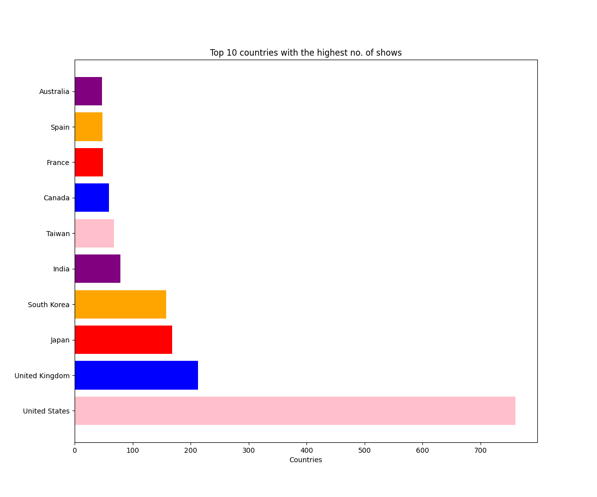

# 📺 Netflix Data Visualization Project

This project analyzes and visualizes data from Netflix to uncover key trends related to content types, durations, ratings, release timelines, and country-wise contributions. Leveraging Python and popular visualization libraries, I created a series of insightful plots to explore how Netflix content has evolved over the years.

---

## 📁 Dataset Overview

- **File**: `netflix_titles.csv`  
- **Source**: `https://www.kaggle.com/datasets/shivamb/netflix-shows`

### 🔹 Key Columns in the Dataset:

| Column Name     | Description                                   |
|-----------------|-----------------------------------------------|
| `show_id`       | Unique identifier for each show               |
| `type`          | Indicates whether the content is a Movie or TV Show |
| `title`         | Title of the content                          |
| `director`      | Director(s) of the show/movie                 |
| `cast`          | Main cast members                             |
| `country`       | Country where the content was produced        |
| `date_added`    | Date the content was added to Netflix         |
| `release_year`  | Year the content was released                 |
| `rating`        | Audience rating (e.g., TV-MA, PG)             |
| `duration`      | Length (in minutes or number of seasons)      |
| `listed_in`     | Categories or genres                          |
| `description`   | Short summary of the content                  |

---

## 🧰 Tools & Technologies

- Python  
- Jupyter Notebook  
- Pandas  
- Matplotlib  
- Seaborn  

---

## 📊 Visualizations Included

- 🎥 **Movies vs TV Shows Comparison**
- 📊 **Rating Distribution (Pie Chart)**
- ⏱️ **Duration Distribution of Movies**
- 🆚 **Content Type Breakdown (Movies vs TV Shows)**
- 📅 **Releases Per Year**
- 📈 **Trend of Content Releases Over Time**
- 🌍 **Top 10 Countries Producing the Most Content**

All visualizations are exported and available as PNG images in the project directory.

---

## ▶️ How to Run the Project

1. Clone or download the repository  
2. Open `Netflix_Analysis.ipynb` using Jupyter Notebook or Google Colab  
3. Execute each cell sequentially to view the analysis and visualizations

---

## 📷 Sample Visualization

---

## 👨‍💻 Author

**Muhammad Usman**  
GitHub: (https://github.com/usmannaeem84)  
Email: usman.naeem12257@gmail.com

---

## 📜 License

This project is licensed for open use and can be freely used for educational and learning purposes.
